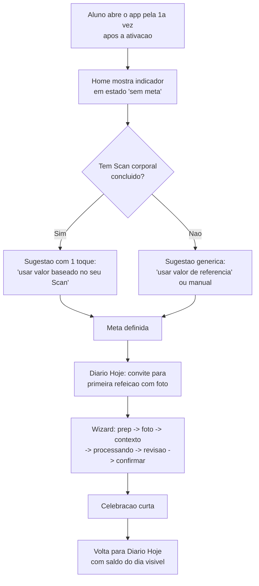
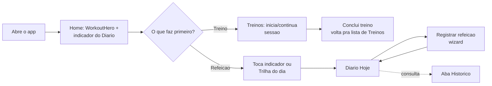
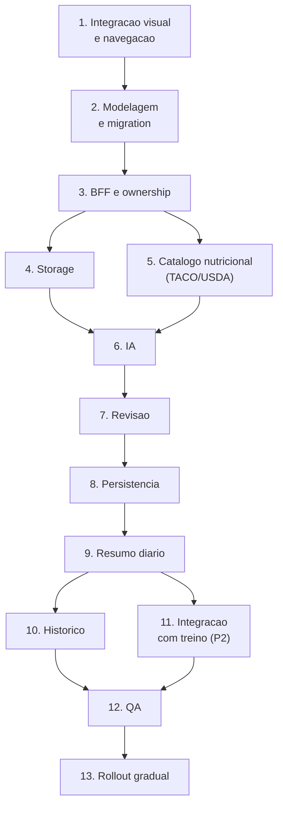

# 07 — Integração do Diário Alimentar na experiência real do Move

> Status: **proposta de produto e desenho de integração**, ainda nada implementado. Este documento assume que quem lê não participou da conversa que o gerou — todo fato citado aponta para o arquivo real que o sustenta, e toda opinião é marcada como hipótese ou recomendação, não como fato.

## 1. Resumo executivo

O Diário Alimentar existe hoje só como protótipo mockado (`/lab/diario-7k2x`, branch `Nova-feat-diario-calorico`) e como uma documentação de proposta muito bem fundamentada (`docs/diario-alimentar/01` a `06`). Nada disso está integrado ao produto real: nenhuma rota, nenhum item de navegação, nenhuma tabela, nenhum endpoint.

Este documento cruza essa proposta com o produto **real** — Home, `AppShell`, `buildNavigation`, Treinos, Histórico, MoveScan — e chega a uma recomendação de integração. Resumo das decisões:

- **Home**: não inserir mais um card numa lista já longa, e também não reescrever a Home inteira agora. Elevar o Diário a um segundo bloco "hero" ao lado do treino do dia — um meio-termo entre inserção incremental e reorganização completa (alternativa C, seção 7).
- **Bottom nav mobile**: substituir "Histórico" por "Diário" — recomendação firme, mas marcada como a decisão de maior impacto que precisa de validação do dono do produto (Histórico é uma feature real e usada, não descartável por suposição).
- **Rota e shell**: manter `/app/diario`, dentro do `AppShell` normal, sem esconder sidebar/bottom-nav e sem modal de tela cheia — nenhuma feature real do produto usa esse padrão hoje, incluindo o MoveScan.
- **Wizard de refeição**: reformular de modal (`fixed inset-0 z-50`, como está no protótipo) para fluxo dentro da própria página, seguindo o padrão real do Scan e dos Treinos.
- **P1**: meta + registro com foto + revisão humana obrigatória + saldo do dia + trilha do dia + macros com split automático. Sem variação de peso estimada, sem integração com Treinos, sem compartilhamento com o personal.

## 2. Estado atual do produto

Fatos confirmados em `main` (SHA `373339f58fd43a27907630d158154bdd23b1a2c3`) nesta sessão, via `git fetch origin --prune` + `git rev-parse`.

### 2.1 Home do aluno (`src/app/app/page.tsx`)

Dois estados, decididos por `buildStudentChecklist(me)` em `app-utils.ts`:

**Ativação** (checklist incompleto — perfil, objetivo, personal, primeiro treino visto, primeira sessão concluída):
Saudação → 3 `MetricCard` (Perfil, Personal, Treinos="--") → `StepperChecklist` + coluna "Acesso rápido" (Treinos, Histórico, Perfil).

**Diária** (checklist completo, `StudentDailyHome`):
Saudação → 3 `MetricCard` (Treinos ativos, Últimos 7 dias, Sessões) → `WorkoutHero` (treino ativo / "personal preparando" / "nenhum treino ativo") + coluna "Acesso rápido" (Meus treinos, Meu perfil) → card de destaque do **Scan corporal** (badge "Novo") → `RecentActivityCard` (última sessão concluída ou vazio) → `ActivationSummaryCard` (recapitulação do checklist já concluído).

Isso é **7 blocos empilhados** no mobile (`page.tsx:414-563`, layout completo lido nesta e na sessão anterior). `lg:grid-cols-[1.1fr_0.9fr]` no desktop (hero + acesso rápido lado a lado); no mobile tudo empilha em coluna única, `pb-24` para não colidir com o bottom nav.

### 2.2 Navegação (`AppShell.tsx` + `app-utils.ts:buildNavigation`)

```
Aluno: Início · Treinos · Chat Move · Galeria · Histórico · Perfil · Scan  [+ Admin]
```

- **Sidebar desktop**: lista completa, sempre visível, 240px fixos.
- **Bottom nav mobile**: `navigation.slice(0, 5)` → Início, Treinos, Chat Move, Galeria, Histórico. Perfil e Scan ficam só no menu overlay (hambúrguer).
- **Overlay mobile**: lista completa + sair da conta.
- Nenhuma rota do app esconde a sidebar/bottom-nav em nenhum estado — confirmado lendo `AppShell.tsx` inteiro (o componente só usa `pathname` para destacar o item ativo, nunca para esconder chrome) e confirmado de novo lendo Treinos e Scan.

### 2.3 Treinos (`src/app/app/treinos/page.tsx`, 2867 linhas)

- Uma única rota `/app/treinos`; lista, detalhe e execução são **estados de client** (`list | detail | executing`), não URLs diferentes.
- Execução: barra superior fixa com "Cancelar" (X) + barra de progresso — ainda dentro do `AppShell`, sidebar/bottom-nav visíveis o tempo todo.
- Sair da execução: se nada foi registrado, sai direto; se alguma série foi marcada/pulada/anotada, abre modal de confirmação ("Cancelar treino?" / "Continuar treinando" vs. "Sair do treino") — **confirmação condicionada a progresso real perdido**, não uma regra fixa.
- Conclusão: tela de celebração (troféu+check, "Treino concluído!", 3 pílulas de estatística: séries feitas/planejadas/puladas). **Sem redirecionamento automático** — o aluno toca "Voltar para treinos", que volta para a **lista** em `/app/treinos`, não para a Home.
- `duration_seconds` é salvo (`workout_sessions`), mas **não vira nenhum valor de calorias/gasto em lugar nenhum do produto hoje** — nem na tela de execução, nem no histórico.

### 2.4 Histórico (`src/app/app/historico/page.tsx`, lido integralmente)

Feature **real e funcional**, não mockada: busca `/api/v1/student/workout-sessions` e `/api/v1/student/workout-sessions/[id]`. Lista com métricas (treinos concluídos, últimos 7 dias, último) → cards de sessão → detalhe com exercícios e séries. Estado vazio, erro com retry e loading usam os componentes reais compartilhados (`EmptyState` etc.). Bloqueado para personal (`RoleGuard`) — é uma feature exclusivamente do aluno.

### 2.5 MoveScan (`scan/page.tsx`, `scan/novo/page.tsx`, `scan/[scanId]/page.tsx`, lidos integralmente)

- **Três rotas reais**: `/app/scan` (hub) → `/app/scan/novo` (wizard) → `/app/scan/[scanId]` (resultado).
- Hub usa uma "máquina de cenários" (`pickScenario`) com 7 estados: vazio, processando, rejeitado, falhou, rascunho, concluído recente, concluído vencido — cada um com seu próprio hero e CTA.
- Wizard: `PageHeader` + rodapé "Cancelar" (1º passo, sem confirmação) / "Voltar" (passos seguintes) + "Continuar"/"Gerar análise". Rodapé some inteiro durante o passo de processamento.
- Resultado: link de texto "Voltar para o Scan" (não volta pra Home) + gatilho para abrir o Chat Move com contexto do resultado (`scanUnderstandResultTrigger`).
- Descoberta: card de destaque na Home (badge "Novo"), **não está no bottom nav**.
- Existe até um precedente de conteúdo de exemplo **dentro do app autenticado**: `/app/scan/mock-latest` ("Ver exemplo ilustrativo de resultado"), diferente do padrão de rota secreta usado pelo `/lab`.
- Vermelho (`red-500`, não é um token do design system) aparece só no cenário "falhou" (erro técnico real) — nunca para "sua taxa está fora da faixa ideal" ou equivalente.

### 2.6 Componentes e tokens reais (`app-ui.tsx`, `globals.css`)

Vocabulário compartilhado que qualquer nova tela deveria reaproveitar: `PageHeader`, `MetricCard`, `StepperChecklist`, `QuickAction`, `EmptyState`, `SectionCard`, `PlaceholderSection`, `RoleGuard`, `ConfirmActionModal` (reservado para ações destrutivas — usado só em Perfil e Alunos).

Tokens (`globals.css`): tema escuro é o **padrão** (`#0a0a0a` fundo, aplicado no `<html data-theme="dark">` do layout raiz), tema claro é o override. `--accent: #f26a1b` (laranja da marca), `--success: #22c55e`. **Não existe um token de "erro/perigo"** no design system — só o utilitário Tailwind `red-500`, usado pontualmente para falhas técnicas reais. Fontes: Manrope (corpo) + Space Grotesk (display), via `next/font`. `prefers-reduced-motion: reduce` já é respeitado globalmente em `html`/`body`.

## 3. Estado atual do protótipo

(Detalhado no relatório de auditoria anterior; resumo funcional aqui, focado no que importa para a integração.)

`src/app/lab/diario-7k2x/` — rota `/lab/diario-7k2x`, sem link em lugar nenhum do app, sem autenticação, `robots: noindex`. Tela "Hoje" (anel de balanço, macros com drill-down, trilha do dia, lista de refeições, "Análise do dia", gasto calórico, meta) + wizard de 6 passos em **modal de tela cheia** (`fixed inset-0 z-50`) + aba Histórico (14 dias mockados).

Diferenças estruturais em relação ao produto real que este documento precisa resolver:
1. O wizard é um **modal sobre a tela**, escondendo toda a navegação — nem o Scan nem os Treinos fazem isso em nenhum estado.
2. Os componentes são bespoke (`StatCard` próprio em vez de `MetricCard`, chips próprios, cards próprios) — não reaproveitam `app-ui.tsx`.
3. A "IA" retorna sempre os mesmos 5 itens fixos, independente da foto — o texto de análise nutricional real, quando implementado, precisa vir do par IA(visão)+base de dados descrito em `02-metodo-ia-estimativa.md`.

O que o protótipo **acerta** e vale preservar como decisão de produto, não só de código: o estado "meta ultrapassada" já reaproveita a cor de destaque (laranja), não vermelho — consistente com o que o produto real faz em todo lugar.

## 4. Diagnóstico da Home

**O que tem mais peso hoje:** o `WorkoutHero` — é o primeiro bloco de conteúdo real (depois da saudação/métricas) e a única seção com hierarquia visual de "hero" (título grande, CTA principal, estado dedicado para cada situação). Isso comunica, estruturalmente, que treino é o trabalho principal da Home.

**O que está sobrecarregado:** no estado diário, a Home empilha 7 blocos verticais no mobile. Nenhum é dispensável isoladamente, mas a soma já é longa antes de qualquer coisa nova entrar — o próprio `ActivationSummaryCard` (recapitulação de um checklist que já terminou) é o candidato mais fraco: confirma algo que o aluno já sabe, sem ação nenhuma associada.

**O que não deve ser removido:** `WorkoutHero` (é a âncora do produto), os 3 `MetricCard` (orientação rápida), o card do Scan (é o único precedente real de "novo módulo entrando pela Home" e já funciona).

**Existe espaço para inserir sem reorganizar?** Tecnicamente sim — dá para empilhar mais um card. **Hipótese**: fazer isso sem nenhuma reorganização reforça exatamente o problema que a missão quer evitar — não porque um card a mais quebra alguma coisa, mas porque um módulo pensado para uso diário/múltiplas vezes ao dia perde força se entra com a mesma hierarquia visual de um "acesso rápido" secundário.

**Vale evoluir a Home ou só inserir?** Recomendação na seção 7 — nem uma coisa nem outra isoladamente.

## 5. Diagnóstico da navegação

| Onde | Hoje | Avaliação para o Diário |
|---|---|---|
| Sidebar desktop | Lista completa, sem limite de espaço | Adicionar "Diário" é de baixo custo e baixo risco em qualquer cenário |
| Bottom nav mobile | 5 primeiros itens da lista | Único ponto de decisão real — ver abaixo |
| Menu overlay | Lista completa | Sempre disponível, independente de estar no bottom nav |
| Retorno à Home | Nenhum módulo força volta à Home ao terminar — Treinos volta pra lista de Treinos, Scan volta pro hub do Scan | O Diário deveria seguir o mesmo padrão: terminar o wizard volta para o **Hoje do Diário**, não para a Home |

**Diário no bottom nav, substituindo Histórico, mantendo Histórico só no overlay, ou só na sidebar/dentro da Home?** Avaliação por frequência e importância, não pelos slots disponíveis:

- Histórico é uma feature **real**, com dado de verdade, e "ver meu progresso" é parte da identidade de um app de treino — não é uma tela fraca.
- **Hipótese** (sem telemetria de uso real disponível neste repositório): Histórico tende a ser consultado depois de várias sessões — uso periódico/reflexivo. O Diário, se a proposta de produto (seção 1 dos docs 01-06) se confirmar, é usado múltiplas vezes por dia por desenho (café, almoço, lanche, jantar).
- Diferença de frequência é justamente o critério que a missão pede para pesar — não "sobrou um slot".

Recomendação na seção 7.

## 6. Alternativas avaliadas

### A. Inserção incremental

Mantém a Home exatamente como está; adiciona um card/atalho de calorias no mesmo padrão do card do Scan (mesma posição relativa, mesmo tipo de componente).

- **Hierarquia**: sem mudança — Diário entra como mais um item de "descoberta", abaixo do `WorkoutHero`.
- **Impacto no treino do dia**: nenhum.
- **Posição do Diário**: card full-width, provavelmente logo abaixo do card do Scan.
- **Sem meta**: card convida a configurar ("Defina sua meta calórica").
- **Sem refeições**: card mostra estado neutro ("Nenhuma refeição hoje").
- **Dados completos**: card mostra um resumo mínimo (ex.: "1.450 de 2.200 kcal").
- **Mobile/desktop**: sem risco — é o padrão já testado pelo Scan.
- **Vantagens**: menor esforço, menor risco, reaproveita 100% um padrão já validado, reversível.
- **Desvantagens**: para um módulo de uso diário, entra com a mesma hierarquia visual de um módulo esporádico (Scan) — pode não comunicar a frequência de uso pretendida; Home já tem 7 blocos, esse seria o 8º.
- **Esforço**: baixo.
- **Riscos**: baixo (é reversível, é o padrão mais testado do produto).

### B. Home reorganizada como "Seu dia"

Treino e alimentação como dois pilares principais desde o topo; menos sensação de lista de cards, mais visão de estado do dia.

- **Hierarquia**: saudação → dois pilares lado a lado (treino / alimentação) → o resto (métricas, atalhos, atividade recente) reorganizado abaixo.
- **Impacto no treino do dia**: `WorkoutHero` deixa de ser o único hero — passa a dividir o topo com o indicador do Diário. Isso é uma mudança real na hierarquia visual que o treino tem hoje.
- **Posição do Diário**: pilar de mesmo peso visual que o treino.
- **Sem meta / sem refeições / dados completos**: cada pilar tem seus próprios 3-4 estados internos (ver seção 14).
- **Mobile**: os dois pilares empilham — o pilar que vier primeiro (provavelmente treino, por ser o produto já estabelecido) ganha vantagem de posição mesmo "sendo igual" ao outro em teoria.
- **Desktop**: cabe lado a lado, layout mais rico.
- **Vantagens**: resolve o objetivo declarado na hipótese do briefing quase literalmente; comunica bem que alimentação é parte central do produto, não um extra.
- **Desvantagens**: reescreve uma tela que já funciona bem hoje, para uma feature que ainda não foi validada visualmente por ninguém fora deste protótipo; maior superfície de teste/QA; risco de regressão em uma tela crítica (é a primeira coisa que todo aluno vê).
- **Esforço**: alto.
- **Riscos**: médio-alto — mexe na tela mais usada do produto por causa de uma feature ainda não validada.

### C. Pilar elevado, sem reescrever a Home (recomendada)

Meio-termo: a Home mantém sua estrutura atual (saudação, métricas, `WorkoutHero`, atalhos, atividade recente), mas o indicador do Diário entra **no mesmo nível hierárquico do `WorkoutHero`** — não como card de descoberta abaixo dele, e sim como uma segunda seção "hero", logo em seguida — sem exigir reescrever o resto da tela.

- **Hierarquia**: saudação → métricas → `WorkoutHero` → **indicador do Diário (novo hero secundário)** → acesso rápido → atividade recente → (Scan e ativação seguem como estão, mais abaixo).
- **Impacto no treino do dia**: nenhuma mudança estrutural — o `WorkoutHero` continua sendo o primeiro hero, no mesmo lugar.
- **Posição do Diário**: logo abaixo do `WorkoutHero`, com peso visual comparável (não um card pequeno, não uma seção inteira reescrita).
- **Sem meta**: indicador vira um convite compacto ("Configure sua meta de hoje"), no mesmo espírito do estado vazio do Scan.
- **Sem refeições**: indicador mostra a meta e "nenhuma refeição ainda", com o CTA de registrar em destaque.
- **Dados completos**: anel compacto + saldo em uma linha, sem os macros detalhados (isso fica só dentro do Diário — ver seção 10).
- **Mobile**: soma só **um** bloco à Home atual, não dois pilares brigando por espaço na mesma linha.
- **Desktop**: pode ocupar a coluna que hoje é só "Acesso rápido" ao lado do `WorkoutHero`, ou vir logo abaixo — decisão de layout fina, não estrutural.
- **Vantagens**: não mexe no que já funciona; dá ao Diário destaque real (não é "mais um card"); esforço e risco muito menores que a opção B; reversível.
- **Desvantagens**: ainda adiciona um bloco à Home (a Home continua com 8 seções em vez de 7) — não resolve sozinho a sobrecarga geral, só evita piorá-la desproporcionalmente.
- **Esforço**: médio.
- **Riscos**: baixo-médio.

## 7. Recomendação principal

**Home**: alternativa **C**. Reescrever a Home inteira (B) é risco desnecessário para uma feature ainda não validada visualmente por ninguém — a própria missão anterior já apontou isso como prioridade não cumprida. Inserção incremental pura (A) subestima a frequência de uso que a proposta de produto (docs 01-06) declara como premissa central. C entrega a "sensação de nova seção importante" pedida na hipótese do briefing sem reescrever uma tela que hoje funciona.

**Navegação mobile**: substituir **Histórico por Diário** no bottom nav — recomendação firme, não uma lista de opções. Critério: frequência de uso pretendida (múltiplas vezes ao dia vs. consulta periódica). Histórico continua totalmente acessível — sidebar desktop, menu overlay mobile, e um atalho direto a partir de Treinos (ver seção 12). Esta é a decisão de maior impacto do documento inteiro e a que mais precisa de validação do dono do produto antes de virar código (seção 22) — o argumento é sólido, mas não existe telemetria real de uso de Histórico neste repositório para confirmá-lo com dado, só a leitura do que a tela faz.

**Sidebar desktop**: adicionar "Diário" — sem contestação, baixo risco em qualquer cenário.

**Rota**: manter `/app/diario`, como os docs já haviam decidido.

**Shell/layout**: dentro do `AppShell` normal, sem esconder sidebar/bottom-nav, sem modal de tela cheia — nenhum precedente real do produto justifica um modal para um fluxo desse tamanho.

**Tela inicial do Diário**: "Hoje" (anel expandido, trilha, refeições, macros, gasto, meta) — replica a hierarquia já validada no protótipo, só migrada para dentro do padrão de página real.

**Histórico do Diário**: aba interna, não rota separada — ver seção 11.

**Entrada e saída**: entra pelo indicador da Home (toque) ou pela sidebar; sai pelo próprio nome "Diário" ficar destacado na navegação (o aluno sabe que saiu quando o item ativo muda) — sem necessidade de um botão de saída dedicado além da navegação padrão do `AppShell`.

## 8. Jornada do primeiro uso



- **Apresentação curta**: reaproveitar o padrão "Primeiros passos" já usado na Home de ativação (`StepperChecklist`) — não um onboarding à parte com telas próprias.
- **Origem da meta**: manual por padrão. **Recomendação**: quando existir um Scan concluído, oferecer 1 toque com um valor sugerido derivado do `bmr` já calculado (`scan_analyses.bmr`, campo real) — com o texto deixando claro que a sugestão veio do Scan, não inventando uma personalização que não existe se não houver Scan.
- **Não exigir Scan**: confirmado como requisito do briefing — meta manual sempre disponível, sem bloqueio.
- **Aviso de estimativa**: visível desde a primeira tela que mostra um número de calorias, no mesmo padrão do `SCAN_DISCLAIMER`.
- **Checklist do protótipo**: tem 3 itens (meta, primeira refeição, gasto). **Recomendação (hipótese de produto, não fato)**: reduzir para 2 no P1 — meta e primeira refeição. "Gasto" é um conceito secundário que compete pela atenção do momento de ativação sem ser essencial para o primeiro valor entregue (ver saldo do dia).
- **Conclusão do onboarding**: primeira refeição confirmada já é o critério — sem uma tela de "onboarding concluído" separada.

## 9. Jornada recorrente



Contagem de toques para registrar uma refeição a partir da Home, caminho rápido (sem preencher contexto opcional): tocar indicador (1) → "Registrar refeição" (2) → avançar do preparo (3) → escolher/tirar foto (4) → avançar sem preencher contexto (5) → confirmar na revisão (6). **6 toques**, com a revisão humana (passo obrigatório, não pulável) contada dentro desse número — a missão pede simplicidade e revisão obrigatória ao mesmo tempo; este fluxo entrega os dois sem tornar um deles opcional.

## 10. Proposta da nova Home

Wireframe textual (hierarquia, não layout visual) do estado diário com a alternativa C aplicada:

```
Home (aluno, estado diario)
├─ Saudacao + data
├─ Metricas (3 cards): Treinos ativos · Ultimos 7 dias · Sessoes
├─ HERO 1 — Treino do dia (como e hoje, sem mudanca)
├─ HERO 2 — Diario Alimentar (NOVO)
│   ├─ estado sem meta: convite compacto + CTA "Definir meta"
│   ├─ estado com meta, sem refeicao: anel vazio + CTA "Registrar refeicao"
│   └─ estado com dados: anel compacto (1 arco) + saldo em 1 linha + CTA
├─ Acesso rapido (Meus treinos · Meu perfil)
├─ Card Scan corporal (como e hoje, sem mudanca)
├─ Atividade recente (como e hoje)
└─ Recapitulacao do checklist (candidato a reduzir/recolher — secao 4)
```

O indicador da Home é deliberadamente mais simples que o do protótipo: **um arco, não dois**, mostrando só a relação consumido/meta. Gasto, macros e drill-down ficam de fora — isso é o que a seção 14 chama de "informação mínima na Home".

## 11. Proposta do módulo Diário

```
/app/diario  (estado interno: "hoje" | "historico" | "wizard")
├─ Aba "Hoje" (tela inicial)
│   ├─ acima da dobra: anel de balanco completo (2 arcos) + saldo + CTA "Registrar refeicao"
│   ├─ trilha do dia (4 ancoras)
│   ├─ lista de refeicoes do dia
│   ├─ macros com meta (com drill-down)
│   ├─ "Analise do dia" (sob demanda)
│   ├─ gasto calorico (atividade manual / estimativa)
│   └─ meta diaria (editar)
├─ Aba "Historico"
│   └─ ver secao 13
└─ Wizard de refeicao (nao e uma rota separada — estado dentro da propria pagina,
    seguindo o padrao de Treinos/Historico, nao o de rotas separadas do Scan)
```

**Por que "Hoje" e "Histórico" como abas internas, não páginas separadas ou rotas com URL própria**: dos dois padrões reais que já coexistem no produto — rotas separadas (Scan) e estado de cliente numa única rota (Treinos, e também o próprio Histórico de treinos, que resolve lista+detalhe com `selectedSessionId` em vez de rota própria) — o segundo é maioria, e é o mais adequado a algo consultado várias vezes ao dia: menos transições de página, sem re-render de layout a cada troca de aba. O protótipo já usa abas de estado (`view: "hoje" | "historico"`) — isso pode ser preservado.

**Wizard como estado, não modal**: diferente do protótipo. Segue o padrão real do Scan (`novo/page.tsx`) — cabeçalho com progresso, rodapé "Cancelar"/"Voltar" + "Continuar", sidebar/bottom-nav visíveis o tempo todo, rodapé escondido durante o processamento.

**Retorno ao treino/Home**: terminar o wizard volta para a aba "Hoje" do Diário (não força volta à Home) — mesmo padrão que Scan e Treinos já usam para seus próprios fluxos.

## 12. Relação com Treinos

- **Gasto vindo de sessão concluída**: hoje **não existe** nenhum cálculo de calorias a partir de `workout_sessions` em nenhuma tela do produto — só `duration_seconds` é salvo. Ligar isso ao Diário é trabalho novo, não uma integração de algo que já existe. **Recomendação**: P2, não P1 — e quando entrar, marcar claramente como estimativa (duração × fator genérico), nunca como medição.
- **Atividades manuais**: manter o padrão de chips do protótipo (atividades rápidas + entrada customizada) para P1 — não depende de nada novo.
- **Prevenção de duplicidade**: quando a integração com sessões existir (P2), uma entrada de gasto originada de `workout_session_id` precisa ser visualmente distinta e não duplicável manualmente — evita o aluno contar o mesmo treino duas vezes (uma vez automático, uma vez como atividade "Treino de força" manual).
- **Mensagens pós-treino**: hoje a tela de conclusão do treino não menciona calorias. **Hipótese de produto**: um convite opcional ("registrar esse treino como gasto no Diário") poderia aparecer ali no P2 — não recomendado para P1, e nunca automático sem confirmação do aluno.
- **Retorno do Diário para Treinos**: navegação padrão do `AppShell` (trocar de item) — sem necessidade de um atalho dedicado.
- **Treino do dia dentro do Diário**: **recomendação — não duplicar**. O `WorkoutHero` já é a fonte única de verdade sobre o treino do dia; o Diário não deveria renderizar um segundo resumo de treino independente, sob risco de os dois ficarem dessincronizados.
- Nenhuma fórmula de gasto proposta aqui é validada clinicamente — toda conversão de duração/atividade em calorias é estimativa, e isso precisa de decisão de negócio explícita antes de virar número na tela (seção 22).

## 13. Histórico

Avaliação crítica do histórico mockado, item por item:

| Peça | Classificação | Justificativa |
|---|---|---|
| Balanço do período | **Manter no P1** | Matemática simples, real, direto do próprio dado do diário |
| Dias dentro da meta | **Manter no P1** | Mesmo caso acima |
| Consumo por dia (gráfico de barras) | **Manter no P1**, mas começar com **7 dias**, não 14 | Um aluno novo não terá 14 dias de dado tão cedo; 7 dias já é útil e cresce naturalmente |
| Gasto | **Manter no P1** | Depende só de atividades manuais, que já são P1 |
| Macros no histórico (retroativo) | **Mover para P2** | O drill-down "de onde veio esse macro" já é rico para o dia atual; historicamente é informação adicional, não essencial para o lançamento |
| **Variação de peso estimada** | **Remover do P1** | Ver abaixo |

**Sobre a variação de peso estimada**: não é confiável o bastante para aparecer como número. Ela compõe **dois** erros em sequência — a estimativa de calorias por foto (o próprio benchmark em `01-benchmark-apps.md` documenta erro de ±9% a ±50% dependendo do prato) e a conversão genérica de ~7.700 kcal por kg (uma média populacional, não personalizada). Apresentar um "+0,35 kg" como se fosse um dado, quando na verdade é um erro multiplicado por outro erro, é exatamente o tipo de "promessa nutricional" que a missão pede para evitar. **Recomendação**: fora do P1; se voltar no P2, só em linguagem qualitativa/direcional ("tendência de déficit ao longo da semana"), nunca em kg, e com aprovação explícita do dono do produto — é uma decisão sensível o bastante para não ser tomada só por este documento.

## 14. Gamificação e indicador diário

### Formato

Dois tamanhos do mesmo componente, não dois componentes diferentes:
- **Home (compacto)**: um arco (consumido/meta), saldo em texto grande, sem macros.
- **Diário (completo)**: dois arcos (consumido/meta e gasto/referência), como o protótipo já faz — isso já está bem resolvido, só precisa migrar para dados reais.

### Cores e tom

- Estado "dentro da meta": laranja de marca (`--accent`), o mesmo usado em todo o resto do produto para "em andamento/em foco" — não é preciso inventar uma cor "boa" específica de nutrição.
- Estado "meta ultrapassada": **continua laranja**, igual ao protótipo já faz — nunca vermelho. Vermelho, no produto real, é reservado a falhas técnicas (Scan) e ações destrutivas (`ConfirmActionModal`); usá-lo aqui misturaria "você comeu mais do que planejou" com "algo quebrou", que é precisamente a culpabilização que a missão pede para evitar.
- Nenhum ícone de alerta/exclamação para meta ultrapassada — só a mudança de texto ("X kcal acima da meta" em vez de "X kcal disponíveis").

### Estados obrigatórios

| Estado | O que a Home mostra |
|---|---|
| Primeiro acesso / meta não definida | Convite compacto, sem anel vazio "quebrado" — mesmo princípio do `WorkoutHero` para "sem treino" |
| Nenhuma refeição registrada | Anel com a meta cheia (100% disponível), CTA em destaque |
| Refeição registrada | Anel parcial, saldo atualizado |
| Dentro da meta | Cor padrão (laranja), tom neutro/positivo |
| Meta ultrapassada | Mesma cor, texto muda de "disponíveis" para "acima da meta" — sem vermelho |
| Dados processando | Indicador sutil de que uma refeição está em análise (sem travar o resto da Home) |
| Erro na análise | Mensagem curta e acionável ("não conseguimos analisar essa foto, tente de novo"), nunca um número quebrado ou "NaN" |

### Microinterações

- Entrada do indicador na Home: sutil (fade/scale curto) — a Home é um resumo, não o momento de celebrar.
- A celebração teatral (confete, contagem, selo) fica **dentro** do Diário, no momento em que a refeição é de fato confirmada — não na Home.
- **Recomendação de ajuste ao protótipo**: a sequência de celebração atual (~2s até o botão principal aparecer, confete completo) é adequada para as primeiras vezes, mas o Diário é usado 3-4x por dia — o que é delicioso na primeira refeição pode virar fricção na quinta. Vale considerar uma versão abreviada a partir do 2º registro do mesmo dia (ex.: sem confete, só o check + contagem). Isso é uma hipótese de produto, não uma correção obrigatória.
- A gamificação deve reforçar **consistência de registro** (sequência de dias, refeições completas no dia), não "comer menos" — os docs (`05-frontend-animacao.md`) já tomam essa decisão corretamente; este documento só reforça que ela precisa se manter até a implementação final.

## 15. Estados e erros

| Situação | Comportamento recomendado | Precedente real reaproveitado |
|---|---|---|
| Sem internet | Banner de erro + tentar novamente, sem perder o que já foi preenchido no wizard | Padrão de erro do Histórico/Scan |
| Upload interrompido | Permitir retomar sem reiniciar o wizard do zero | Novo — protótipo não precisa resolver isso hoje |
| Foto inválida | Reusar o conceito de qualidade por dimensão do Scan (`status: ok/ajustar`, `needsRetake`) | `OpenAiScanClient` / `SCAN_QUALITY_TIPS` |
| IA falhou | Mesma taxonomia de erro do Scan (timeout, chave inválida, cota excedida, recusa) | `OpenAiScanClient.analyze` |
| Análise demorando | Esconder navegação de avançar/voltar durante o processamento, como o wizard do Scan já faz | `scan/novo/page.tsx` (rodapé some em "processing") |
| Alimento não identificado / confiança baixa | Já resolvido no protótipo — indicador de confiança por item, edição livre | `ConfidenceDot`, revisão editável |
| Usuário corrige os itens | Comportamento real já correto no protótipo — manter | `updateGrams`, `addItem`, `removeItem` |
| Usuário abandona o wizard | Sem confirmação antes de gastar uma chamada de IA (nada perdido); **com** confirmação leve depois do processamento (uma análise real já foi gasta) | Extensão do padrão de Treinos ("só confirma se algo se perde") — aqui o "algo" é o custo da chamada de IA, que Treinos não tem |
| Usuário volta depois (rascunho) | Para o P1, tratar como Scan trata hoje: retomar rascunho está fora de escopo ("estará disponível em breve" é a mensagem real do próprio Scan) — abandonar = recomeçar | `scan/page.tsx` `DraftHero` |
| Dia sem registros | `EmptyState` compartilhado, tom convidativo, não de cobrança | `app-ui.tsx:EmptyState` |
| Mudança de data | Lógica do protótipo (`dateKey` diferente de hoje reinicia o dia) é o comportamento certo; a versão real precisa definir isso com fuso horário no servidor, não só no relógio do navegador | `mock.ts:todayKey/loadDay` |
| Meta alterada | Preservar a meta histórica por dia (série temporal), nunca recalcular dias passados — os docs (`04-modelagem-dados.md`) já desenham isso corretamente com `effective_from` | `daily_calorie_targets` (proposto) |
| Refeição duplicada | **Gap real, sem solução hoje**: nada impede duplo toque em "Confirmar refeição" nem no protótipo nem nos docs — precisa de proteção (desabilitar botão no envio, ou chave de idempotência) na implementação real | — |

## 16. Experiência futura do personal

- **O que o personal não vê no lançamento**: nada do Diário Alimentar do aluno — nem que o módulo está em uso, nem resumo, nem histórico.
- **Base para isso**: `REGRAS_NEGOCIO_MOVE.md` já lista "diário pessoal" como dado que exige permissão explícita do aluno para o personal ver — a regra de produto para isso já existe, só precisa de fluxo.
- **Possibilidade futura**: consentimento granular (ex.: compartilhar só o resumo diário, não os itens/fotos), iniciado e revogável pelo aluno — nunca solicitado de um jeito que pareça pressão do personal.
- **Dados que poderiam ser compartilhados, em ordem de sensibilidade crescente**: saldo/meta do dia → macros do dia → refeições individuais → fotos.
- **Riscos de exposição**: dado alimentar é mais sensível que dado de treino — toca corpo, hábito, possivelmente insegurança alimentar. **Recomendação** (valor de produto, não conclusão técnica): se/quando isso for construído, o padrão default deve ser "desligado", e a ativação sempre partir do aluno.
- **Onde entraria no futuro**: dentro de Acompanhamento, o módulo que já existe para o personal ver dados do aluno — não um módulo novo.

## 17. P1 / P2 / Futuro

### P1 — necessário para lançamento real

Meta calórica (manual + split automático 25/45/30) · registro de refeição com foto real · IA híbrida (visão + TACO/USDA) · revisão humana obrigatória antes de salvar · saldo do dia (anel completo no Diário, arco único na Home) · trilha do dia (4 âncoras + extra) · "Análise do dia" por regras determinísticas · gasto por atividade manual · histórico de 7 dias (balanço, dias na meta, gráfico) · indicador na Home (alternativa C) · Diário no bottom nav no lugar de Histórico · disclaimer de estimativa em toda tela relevante.

### P2 — evolução imediata

Gasto automático a partir de sessão de treino concluída (com prevenção de duplicidade) · histórico estendido a 14+ dias com macros retroativos · split de macro personalizado pelo personal · IA generativa nas dicas via Chat Move (mesmo padrão do `scanUnderstandResultTrigger`) · consentimento de compartilhamento com o personal · notificação de lembrete de refeição · celebração abreviada em registros subsequentes no mesmo dia.

### Futuro — não desenvolver agora

Variação de peso estimada (só volta com aprovação explícita e linguagem qualitativa) · leitura de rótulo/código de barras · matching avançado (embeddings) contra TACO/USDA · retomar rascunho de refeição abandonada · biblioteca de animação dedicada, se o CSS puro não for suficiente.

## 18. Trilha de implementação



| Bloco | Objetivo | Depende de | Áreas afetadas | Risco | Critério de pronto |
|---|---|---|---|---|---|
| 1. Integração visual e navegação | Validar Home (alt. C) e nav com dados falsos estáticos, sem lógica nova | Aprovação deste documento | `page.tsx`, `app-utils.ts`, `AppShell.tsx` | Baixo | Design aprovado visualmente em mobile e desktop |
| 2. Modelagem e migration | Criar as 4 tabelas + bucket de `04-modelagem-dados.md` | Bloco 1 aprovado | `supabase/migrations/` (novo arquivo) | Médio (schema é definitivo depois de dados reais existirem) | Migration aplicada e validada, seguindo o processo de `docs/dev/pending-migrations.md` |
| 3. BFF e ownership | Criar `src/bff/modules/foodDiary/` com guards de autenticação/ownership | Bloco 2 | `src/bff/modules/foodDiary/*` (novo) | Baixo (padrão já existe no Scan) | Rotas rejeitam acesso sem dono correto |
| 4. Storage | Bucket privado `food-diary-photos`, upload com URL assinada | Bloco 3 | Supabase Storage | Baixo (padrão idêntico ao Scan) | Upload/leitura só via BFF, nunca client-side direto |
| 5. Catálogo nutricional | `NutritionLookupClient` (TACO prioridade, USDA fallback) | Bloco 3 | `src/bff/modules/foodDiary/infra/` (novo) | Médio (peça sem equivalente no Scan) | Busca retorna valor nutricional para os itens de teste do benchmark |
| 6. IA | `OpenAiFoodDiaryClient`, clone do padrão `OpenAiScanClient` | Blocos 4 e 5 | `src/bff/modules/foodDiary/infra/` (novo) | Médio (qualidade real da estimativa só se mede com uso real) | Resposta valida contra o schema Zod, erro tratado nas 4 categorias do Scan |
| 7. Revisão | Tela de revisão real, ligada à API | Bloco 6 | `src/app/app/diario/*` (novo, componentes do protótipo adaptados) | Baixo (UX já validada no protótipo) | Edição de gramas recalcula sem nova chamada de IA |
| 8. Persistência | Salvar `food_diary_entries`/`items` de verdade | Bloco 7 | BFF + rotas `/api/v1/food-diary/*` | Baixo | Refeição confirmada sobrevive a reload |
| 9. Resumo diário | `DailyBalanceService`, indicador real na Home e no Diário | Bloco 8 | `page.tsx` (Home), `src/app/app/diario/page.tsx` | Baixo | Saldo bate com a soma manual das refeições do dia |
| 10. Histórico | Agregação de 7 dias com dado real | Bloco 9 | `src/app/app/diario/*` | Baixo | Gráfico bate com os dados reais salvos |
| 11. Integração com treino (P2) | Ligar `workout_session_id` a `activity_energy_entries` | Bloco 9 | `bff/modules/workouts`, `bff/modules/foodDiary` | Médio (regra de duplicidade) | Sessão concluída gera no máximo uma entrada de gasto |
| 12. QA | Testar os estados da seção 15 fim a fim | Blocos 7–10 | — | — | Todos os estados da tabela da seção 15 verificados manualmente |
| 13. Rollout | Lançamento gradual (ex.: card antes de virar aba fixa, se essa cautela for adotada) | Bloco 12 | `app-utils.ts` (nav) | Baixo | Decisão de nav (seção 7) já validada com dado real de uso, se possível |

## 19. Impacto técnico

- **Reaproveitável quase como está**: as funções puras de `mock.ts` (`macrosForItem`, `sumMacros`, `macroTargetsForKcal`, `dayBalance`, `macroContributions`) — são cálculo correto, sem estado, sem acoplamento a mock; só trocam a fonte dos números.
- **Reaproveitável com adaptação**: `BalanceRing.tsx` (props precisam vir de dado real, lógica de animação já está correta), `bits.tsx` (`MealIcon`, `DayTrail` — trocar só a fonte de dados; `ConfettiRain` mantém se a recomendação da seção 14 for aceita), boa parte de `lab.css` (as `@keyframes` não têm nenhuma dependência de mock).
- **Precisa ser reescrito, não portado**: `DiaryLab.tsx` (1055 linhas) e `MealWizard.tsx` (830 linhas). Dois motivos: (1) arquivos de mais de mil linhas concentram estado, UI e regra de decisão de tela inteira num único componente — difícil de revisar, testar e dar manutenção, e o resto do produto não tem esse padrão (Treinos, que é grande, já é dividido em `_components/` por responsabilidade); (2) o wizard precisa deixar de ser modal (seção 11), o que já muda sua estrutura de navegação por dentro.
- **Estratégia de decomposição recomendada**: seguir o mesmo padrão que `treinos/_components/` e `scan/_components/` já usam — um arquivo por seção/responsabilidade (ex.: `DiaryHero.tsx`, `DiaryMacroPanel.tsx`, `DiaryMealsList.tsx`, `DiaryActivitySection.tsx`, `MealWizardStep*.tsx`), com um componente "página" fino que só orquestra estado e roteia entre eles — não um arquivo monolítico.
- **Pontos onde mock precisa virar chamada real**: `buildMockAnalysisItems` (IA), `FOOD_CATALOG` (vira busca em TACO/USDA), `buildMockHistory` (vira agregação real), `loadDay`/`saveDay` em `localStorage` (vira API + estado do servidor).
- **Integração com a arquitetura BFF existente**: segue à risca o padrão descrito em `docs/GUIA_DESENVOLVIMENTO_WEB_BFF_MOVE.md` (rota → schema → auth guard → service → repository), o mesmo que o módulo Scan já implementa — não é uma exceção arquitetural, é mais um módulo no mesmo molde.

## 20. Arquivos afetados

**Novos:**
```
src/app/app/diario/page.tsx
src/app/app/diario/_components/*.tsx   (decompondo DiaryLab/MealWizard)
src/app/app/diario/_content.ts
src/app/app/diario/_types.ts
src/bff/modules/foodDiary/types/index.ts
src/bff/modules/foodDiary/types/IFoodDiaryRepository.ts
src/bff/modules/foodDiary/infra/FoodDiaryRepository.ts
src/bff/modules/foodDiary/infra/OpenAiFoodDiaryClient.ts
src/bff/modules/foodDiary/infra/NutritionLookupClient.ts
src/bff/modules/foodDiary/services/FoodDiaryAiService.ts
src/bff/modules/foodDiary/services/DailyBalanceService.ts
src/bff/modules/foodDiary/factories/makeFoodDiaryService.ts
src/app/api/v1/food-diary/**/route.ts + schema.ts
src/services/foodDiary/foodDiaryService.ts
supabase/migrations/*_food_diary_foundation.sql   (não criado nesta tarefa)
```

**Modificados (arquivos reais existentes):**
```
src/app/app/app-utils.ts        — buildNavigation (novo item "Diário")
src/app/app/AppShell.tsx        — NAV_ICONS (novo ícone)
src/app/app/page.tsx            — StudentDailyHome (novo hero secundário)
.env.example                    — OPENAI_FOOD_DIARY_MODEL (por analogia a OPENAI_SCAN_MODEL)
docs/GUIA_DESENVOLVIMENTO_WEB_BFF_MOVE.md  — nota opcional esclarecendo que o exemplo
                                              "student-diary" não é esta feature (evita
                                              confusão futura; higiene de documentação)
src/bff/modules/chat/context-triggers/     — novo foodDiaryUnderstandDayTrigger (P2)
```

## 21. Riscos

- Erro composto (IA + conversão kcal→kg) apresentado como número preciso — mitigado ao remover variação de peso do P1 (seção 13).
- Custo/volume de chamadas de IA: Diário é usado várias vezes ao dia por usuário, Scan é ~1x/mês — dimensionar orçamento de IA antes do P1 real, não depois.
- Dupla contagem de gasto (treino automático + atividade manual) se o bloco 11 (seção 18) for implementado sem a regra de exclusividade.
- Refeição duplicada por duplo toque — gap real sem solução hoje (seção 15).
- Herdar a limitação do próprio Scan de não suportar retomar rascunho — aceitável para P1, mas é uma dívida técnica já existente sendo importada, não nova.
- Mudar o bottom nav (Histórico → Diário) sem validação de uso real pode prejudicar quem hoje depende de Histórico ali.
- Avanço de escopo no compartilhamento com o personal — mitigado por manter isso fora do P1 e exigir consentimento explícito quando entrar.
- Fadiga de animação em uso de alta frequência (seção 14) — mitigado com a recomendação de celebração abreviada.
- Foto do prato pode conter mais contexto pessoal do que fotos de scan corporal (mesa, ambiente, outras pessoas) — vale revisar se o texto de consentimento precisa mencionar isso especificamente (decisão pendente, seção 22).

## 22. Decisões pendentes (dono do produto)

- Confirmar a troca de Histórico por Diário no bottom nav — com dado de uso real, se possível, antes de fechar.
- Checklist de primeiro uso: 2 itens (recomendado) ou 3 (como está no protótipo)?
- Variação de peso estimada: fora para sempre, ou reconsiderar no P2 com linguagem qualitativa?
- Formato exato do consentimento de compartilhar com o personal (o quê exatamente é compartilhável, seção 16).
- Adicionar a dependência `motion` para a animação do anel, ou manter CSS/SVG puro indefinidamente?
- Orçamento/limite de chamadas de IA por aluno por dia.
- Gasto de treino: soma automática ao concluir sessão, ou sempre exige confirmação do aluno?
- Quanto da "teatralidade" do passo de processamento (caixas de detecção sobre a foto) é honesto manter quando a análise for real (seção 14/anexo do relatório anterior já levanta isso) — decisão de tom de marca, não só técnica.
- Se o texto de consentimento de foto de refeição precisa ser diferente do texto usado no Scan (contexto de ambiente/mesa vs. corpo).

## 23. Critérios de aceite de produto

- Aluno consegue definir uma meta e registrar uma refeição completa em até 6 toques a partir da Home.
- Nenhum estado do indicador ou do Diário usa vermelho ou ícone de alerta para "meta ultrapassada".
- O aviso de estimativa (não substitui acompanhamento profissional) aparece em toda tela que mostra calorias/macros calculados.
- Nenhum texto do módulo usa linguagem prescritiva ("você deve", "evite") — só observação neutra.
- Abandonar o wizard antes do processamento não pede confirmação; abandonar depois, pede.
- Histórico de treinos continua alcançável em no máximo 2 toques, mesmo fora do bottom nav.
- Nenhuma tela do Diário real é alcançável sem autenticação (ao contrário do estado atual do `/lab`).
- O indicador da Home nunca mostra mais do que um arco e um valor de saldo — detalhe completo só dentro do Diário.
- Editar a gramatura de um item na revisão recalcula na tela sem nova chamada de IA.

## 24. Momentos candidatos para divulgação futura

A serem capturados do **front real aprovado**, nunca do protótipo `/lab` nem de uma interface inventada — mesma exigência já registrada na auditoria anterior.

- Indicador na Home (o momento em que ele aparece com dado real, não vazio).
- Captura da foto — em especial o instante de posicionar o objeto de referência, que é o diferencial real de precisão do produto frente aos concorrentes mais fracos do benchmark.
- Processamento (se a decisão da seção 22 mantiver algum tipo de feedback visual de análise).
- Revisão dos alimentos — é o momento que melhor comunica "IA com revisão humana", o diferencial frente a apps que confiam só na IA.
- Resultado/celebração de refeição registrada.
- Saldo do dia completo, com meta e macros.
- Histórico (gráfico de 7+ dias).

## Confirmação

Esta sessão criou **apenas** este arquivo (`docs/diario-alimentar/07-integracao-experiencia-move.md`), na working tree local, na branch `Nova-feat-diario-calorico` (checkout limpo de `origin/Nova-feat-diario-calorico`, sem merge). Nenhum commit, push, migration, endpoint, dependência, arte ou alteração em `.vscode/mcp.json` ou nos arquivos de marketing foi feito.
