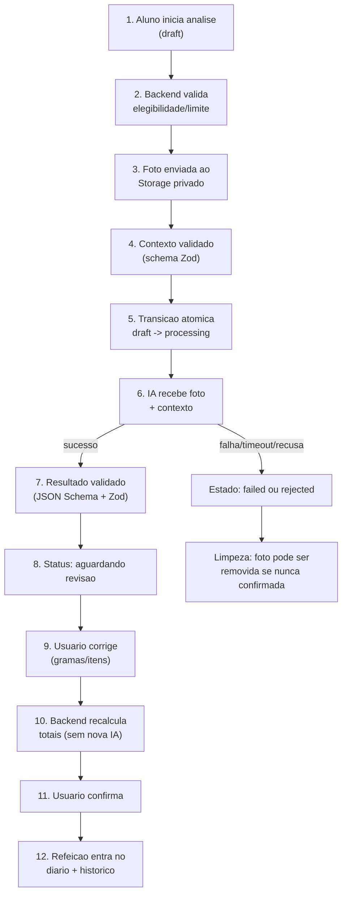

# 08 — Método de análise de refeição por imagem

> Status: **pesquisa e recomendação técnica**, nada implementado. Este documento responde a uma pergunta específica: como a análise real de refeições vai funcionar quando deixarmos de usar mocks. Ele assume que quem lê não participou da pesquisa — toda afirmação carrega uma marca: **[Fato]** (documentado em fonte primária), **[Alegação]** (declaração comercial de um produto, não verificada de forma independente), **[Inferência]** (conclusão nossa a partir de fatos), ou **[Recomendação]** (decisão de produto proposta aqui).

## 1. Resumo executivo

A pesquisa confirma a direção já tomada nos docs 01–03: abordagem híbrida (IA identifica e estima gramas; uma base de dados calcula nutrientes), revisão humana obrigatória, e objeto de referência na cena. Isso não é intuição — é o padrão que se repete tanto no mercado quanto na literatura acadêmica revisada por pares.

O achado mais importante da pesquisa, e o que mais deveria calibrar as expectativas do produto: **mesmo os métodos mais bem avaliados publicamente têm erro real de 30–45% na estimativa de calorias** quando testados de forma independente e controlada (não pelo marketing do próprio produto) — ver seção 5. Isso não é motivo para não lançar; é motivo para o produto nunca prometer precisão que a tecnologia atual, de ninguém, entrega.

Recomendação firme (detalhada na seção 10): **uma foto**, prompt com raciocínio explícito sobre a referência visual antes de estimar gramas, `OpenAiFoodDiaryClient` clonando o padrão já validado do `OpenAiScanClient` (Responses API + JSON Schema estrito + Zod), nutrientes estimados pela própria IA como *fallback* aceitável no P1 (TACO/USDA entram depois, sem bloquear o lançamento), e revisão humana como portão obrigatório antes de qualquer persistência — exatamente como a missão já havia decidido.

## 2. Proposta atual analisada

A proposta trazida nesta missão, comparada ao que os docs 01–03 já haviam desenhado:

| Elemento da proposta | Já estava em 01–03? | O que a pesquisa confirma ou ajusta |
|---|---|---|
| Foto da refeição | Sim | Confirma: é a entrada mínima em 100% dos produtos pesquisados |
| Tipo/tamanho do recipiente | Não explícito (doc03 tinha "origem", não tamanho do prato) | Pesquisa recomenda incluir — ver seção 9 |
| Referência visual (talher) | Sim, entre outras opções | Confirma o conceito, mas com uma correção de prioridade — ver seção 8 |
| Tipo de refeição | Sim | Confirma |
| Contexto opcional (ingredientes ocultos, preparo) | Sim | Confirma — nenhum produto pesquisado tem isso como obrigatório |
| IA usa alimentos visíveis, proporção, área, volume aparente, escala, contexto textual | Implícito no prompt proposto no doc02 | Confirma; a pesquisa mostra que "raciocinar sobre volume antes de responder" é o que mais separa os melhores resultados dos piores (seção 5) |
| Saída: alimento, gramas, medida caseira, calorias, macros, confiança, observações, totais | Parcial no doc02 (faltava medida caseira) | Ajuste: adicionar medida caseira ao contrato (seção 12) — é o que os apps mais maduros mostram ao lado do grama |
| Revisão humana obrigatória, mas não desculpa para estimativa ruim | Sim (doc02) | Confirma com números: mesmo com revisão, uma estimativa inicial ruim gera mais edições, mais fricção e mais abandono — ver seção 5 e 7 |

## 3. Metodologia da pesquisa

Buscas em duas frentes, deliberadamente separadas:

- **Mercado**: nome do produto + "how it works"/"como funciona", documentação oficial quando existia, e reviews de terceiros só quando não havia fonte primária — nesse caso, tratadas como **[Alegação]**, nunca como **[Fato]**.
- **Técnica**: papers em arXiv, PMC/PubMed Central, ACM, publicações de journals com peer review (Public Health Nutrition, Nutrition Research and Practice), e documentação oficial de API (OpenAI).

Uma nota de honestidade sobre o próprio `01-benchmark-apps.md`: parte das fontes citadas ali (`ai-food-tracker.com`, `nutrola.app`, `askvora.com`, `bestapprankings.com`, `nutriscan.app`) são sites de review de terceiros sem metodologia pública — têm o perfil de conteúdo de afiliado/SEO, não de teste independente auditável. Isso não invalida as conclusões do doc01 (os *padrões* que ele identifica — ninguém confia só na IA, o ponto fraco é o prato misto — são consistentes com a literatura acadêmica revisada aqui), mas os números específicos de precisão daquele documento devem ser lidos como **[Alegação]** de terceiros, não como medição própria. Onde havia fonte primária (documentação oficial, paper revisado por pares), priorizei essa nesta pesquisa.

## 4. Soluções de mercado

| Produto | Fluxo | Fotos | Referência visual | Revisão manual | Como estima porção | Como calcula nutrientes | Limitação declarada | Evidência |
|---|---|---|---|---|---|---|---|---|
| **MyFitnessPal — Meal Scan** | Aponta câmera, app detecta itens, usuário seleciona da lista | 1 (ou live detection) | Não usa objeto físico | Sim — seleção + ajuste de porção obrigatórios ([suporte oficial](https://support.myfitnesspal.com/hc/en-us/articles/360045761612-Meal-Scan-FAQ)) | ML + CV treinado em "milhões de imagens" ([blog oficial](https://blog.myfitnesspal.com/meal-scan/)) | Banco de dados verificado do app | Feature Premium; exige iOS 17+/Android 12+, app 22.17+ | **[Fato]** (fonte oficial) |
| **Cal AI** | Foto única | 1 | Não claro | Sim | Modelo de visão próprio | Banco de dados menor que concorrentes | Subestimativa 25–50% em pratos mistos (doc01) | **[Alegação]** (review de terceiro) |
| **Foodvisor** | Foto única, dicas de enquadramento | 1 | Não claro | Sim, em 15–22% dos casos (doc01) | Modelo de visão + banco próprio | Banco de dados próprio, melhor avaliado do grupo (doc01) | Pratos caseiros seguem sendo o ponto fraco | **[Alegação]** (review de terceiro) |
| **Yazio** | Foto única | 1 | Não claro | Sim | Modelo de visão | Banco próprio | Pior desempenho do grupo testado (doc01) | **[Alegação]** (review de terceiro) |
| **SnapCalorie** | Foto única, usa sensor de profundidade do aparelho | 1 | **Hardware**: sensor LiDAR (iPhones com LiDAR) | Sim | Volume real via LiDAR, não só visão 2D ([TechCrunch](https://techcrunch.com/2023/06/26/snapcalorie-computer-vision-health-app-raises-3m/)) | Não detalhado publicamente | Depende de hardware que **a maioria dos aparelhos não tem** (Android em geral, iPhones sem LiDAR) | Mista — LiDAR é fato do produto, "erro <20%" é **[Alegação]** própria |
| **Passio Nutrition-AI** (SDK/API comercial) | SDK embutido em apps de terceiros; MyFitnessPal e Elevance Health são clientes citados ([site oficial](https://www.passio.ai/)) | 1+ | Não claro publicamente | Depende do app cliente | Modelo próprio + "maior banco de dados visual do mundo" (alegação própria) | Banco de dados próprio | A própria empresa reconhece dificuldade em "pratos em camadas/complexos" | **[Alegação]** (própria empresa), parceria com MFP é **[Fato]** |
| **LogMeal API** (comercial) | API pura — cliente implementa a UI | 1 (RGB) ou sequência com profundidade | Opcional (depth-based quantity API) | **Exigida no design da API** — endpoint dedicado "Food Recognition with Confirmation" ([docs oficiais](https://docs.logmeal.com/docs/guides-use-cases-food-recognition-confirmation)) | RGB (sem referência) ou sequência de imagens com profundidade | 32 micro/macronutrientes por prato, ~1300 pratos reconhecidos | Estimativa de volume só RGB é mais fraca que com profundidade | **[Fato]** (documentação oficial) |
| **Nutritionix** (API/banco de dados) | Não é um app de foto — é a *infraestrutura* nutricional por trás de outros apps | N/A | N/A | N/A | Reconhecimento de imagem existe na oferta, mas o core é o banco de dados | 1M+ alimentos, usado por 20 mil+ apps, 250M+ consultas/mês ([site oficial](https://www.nutritionix.com/api)) | É banco de dados americano — cobertura de comida brasileira não avaliada | **[Fato]** (métricas próprias, mas empresa estabelecida e amplamente integrada) |
| **Apps brasileiros** (Calz, CalorIA, Olho no Prato, "Contador de Calorias com Foto") | Foto única → resultado | 1 | Não documentado publicamente | Não documentado | Não documentado — provavelmente wrapper fino sobre API multimodal genérica | Não documentado | Nenhuma documentação técnica pública encontrada | **[Alegação]** — nenhuma fonte primária localizada; tratar como opacos |

**Padrão que se repete em todo o mercado**: nenhum produto sério pula a revisão do usuário, e os dois únicos que **declaram** melhor precisão (Foodvisor, SnapCalorie) fazem isso por dois caminhos diferentes e não replicáveis por nós no P1 — Foodvisor por ter um banco de dados nutricional próprio grande (nós resolvemos isso com TACO/USDA, arquiteturalmente equivalente), e SnapCalorie por depender de hardware LiDAR que a maioria dos alunos não tem.

## 5. Evidências acadêmicas e técnicas

Esta seção é o núcleo factual da recomendação. Ordenada da mais para a menos diretamente aplicável ao nosso caso (foto única de celular comum, sem hardware especial, prato caseiro brasileiro).

### GPT-4V / GPT-4o para avaliação dietética — a evidência mais relevante para nós

**[Fato]** [Lo et al., "Dietary Assessment with Multimodal ChatGPT: A Systematic Analysis"](https://arxiv.org/abs/2312.08592) (Imperial College London, arXiv dez/2023): GPT-4V atinge **87,5% de acurácia na identificação de alimentos sem nenhum fine-tuning**, e demonstra "consciência contextual" — usa objetos presentes na cena como referência de escala mesmo sem serem colocados deliberadamente para isso, convertendo peso estimado em nutrientes via base USDA.

**[Fato]** ["Reasoning-Driven Food Energy Estimation via Multimodal Large Language Models"](https://pmc.ncbi.nlm.nih.gov/articles/PMC11990770/) (2024/2025), testado no dataset [Nutrition5k](https://github.com/google-research-datasets/Nutrition5k) (Google): quando pedido para estimar **calorias diretamente**, GPT-4o zero-shot erra em média **82,7 kcal (MAPE ~43%)**. Injetar um passo explícito de estimativa de volume no prompt antes da resposta final reduz o erro para 78,8 kcal (MAPE 43,4%, correlação 0,846) — melhora modesta, mas real. Um modelo especializado *fine-tuned* (LLaVA-1.5-13B, não disponível via API comercial) chega a 64,3 kcal / MAPE 39,8% — o melhor resultado do estudo, mas exige infraestrutura de fine-tuning que não temos e não está no escopo do MVP.

**[Inferência]**: a diferença entre "87,5% acerto ao identificar o alimento" e "43% de erro ao estimar a caloria" é a evidência mais direta de que a arquitetura híbrida (IA identifica bem, base de dados calcula os nutrientes) não é só uma preferência arquitetural — é a única forma de não herdar o pior desempenho do modelo.

### Nutrition5k e o problema do volume

**[Fato]** [Nutrition5k](https://arxiv.org/pdf/2103.03375) (Google Research, CVPR 2021): dataset de ~5 mil pratos reais fotografados em câmera RGB-**D** (com profundidade, sensor Intel RealSense) em restaurantes corporativos do Google, cada prato com massa/calorias/macros reais medidos em balança. Um modelo treinado especificamente nesse dataset consegue superar nutricionistas profissionais na estimativa de calorias — mas **[Inferência]**: esse resultado depende de duas coisas que não teremos — câmera com profundidade e um modelo treinado especificamente para aquele domínio de pratos (cafeterias americanas, não comida caseira brasileira). O próprio dataset reconhece essa limitação de generalização geográfica/cultural.

### Objeto de referência físico

**[Fato]** ["Food Portion Estimation via 3D Object Scaling"](https://arxiv.org/abs/2404.12257) (Purdue University, CVPR 2024 **Workshop** — não o programa principal da conferência): usa um **tabuleiro de xadrez** como referência física, mais um modelo 3D pré-escaneado (scanner dedicado Revopoint POP2) de cada tipo de alimento. Resultado: 31,10 kcal de erro médio (17,67% MAPE) no dataset próprio SimpleFood45 — o melhor número numérico desta pesquisa toda, mas **[Inferência]**: inaplicável ao nosso caso, porque exige um modelo 3D pré-existente por *tipo* de alimento (o próprio paper cita erro quando o modelo genérico de "abacate inteiro" é usado para uma fatia de abacate) — não escala para a variedade de comida caseira brasileira sem um catálogo de modelos 3D que não existe.

**[Fato]** Padrão internacional de cartões (ISO/IEC 7810, formato ID-1): **85,60 × 53,98 mm, exatos, em qualquer cartão de crédito/débito/documento do mundo**. É o único objeto do dia a dia com garantia de tamanho fixo — mais confiável, geometricamente, que qualquer talher.

**[Fato]** Mão como referência ([PMC4976119](https://www.ncbi.nlm.nih.gov/pmc/articles/PMC4976119/)): o método de largura do dedo acerta 80% das estimativas dentro de ±25% do peso real para alimentos de **formato geométrico simples** — mas apenas 29% de acerto (equivalente a não ter referência nenhuma) quando comparado a medidas de casa. **[Inferência]**: a mão é uma referência "grátis" (está sempre disponível) mas justamente fraca no nosso pior caso — prato misto, formato irregular.

### Uma ou duas fotos

**[Fato]** [Estudo em Nutrition Research and Practice (2025)](https://e-nrp.org/DOIx.php?id=10.4162%2Fnrp.2025.19.4.605): estimar porção de arroz cozido a partir de uma única foto a 45° acerta 74,4%; combinando múltiplos ângulos, sobe para 85,4%. **[Fato]**, mesmo estudo e revisão geral da área: métodos de imagem única são consistentemente menos precisos que múltiplas vistas, mas são preferidos por exigirem menos do usuário.

### Abordagem sem nenhum objeto de referência (para contraste)

**[Fato]** [Estudo em Public Health Nutrition](https://www.cambridge.org/core/journals/public-health-nutrition/article/imagebased-food-portion-size-estimation-using-a-smartphone-without-a-fiducial-marker/47ED461DDE607FE0C7E6D70168E80BFA): elimina o objeto de referência físico usando o próprio celular (apoiado na mesa) como escala, mais uma interface de realidade aumentada onde o usuário ajusta um cubo virtual até "parecer do tamanho" da comida. Resultado: 16,65% de erro em alimentos de volume grande, mas 47,60% em alimentos pequenos — pior que a maioria dos métodos com referência física, e exige mesa plana/nivelada (falha com comida alta). **[Inferência]**: interessante como conceito de interação, mas a engenharia (sensores de movimento calibrados, overlay de AR) é desproporcional ao ganho de precisão para um MVP em poucos dias.

## 6. Métodos de estimativa encontrados

| Abordagem | Como funciona | Viável para MVP em dias? | Por quê |
|---|---|---|---|
| **A. Modelo multimodal estima tudo direto** | Uma chamada, a IA responde alimento + gramas + calorias | Parcialmente | Identificação é boa (~87%), estimativa de calorias direta é ruim (~43% MAPE) — usar só para identificação+gramas, não para nutrientes |
| **B. Segmentação + profundidade/volume** | Detecta contorno de cada item, estima volume via profundidade | Não | Exige câmera com profundidade (LiDAR) ou modelo de estimativa de profundidade monocular dedicado — engenharia de visão computacional própria, fora do prazo |
| **C. Comparação com objeto de referência conhecido** | Card/moeda/talher/mão na cena calibram a escala | **Sim** | É o único método sem hardware especial que tem evidência real de melhora, e já está no prompt multimodal — não é uma etapa separada |
| **D. Duas fotos em ângulos diferentes** | Fotos múltiplas triangulam volume | Parcial — fica de fora do P1 | Melhora mensurável (74%→85%), mas dobra a fricção de um fluxo que precisa ser rápido e usado várias vezes ao dia |
| **E. Combinação IA + regras + revisão humana** | IA propõe, backend calcula com base de dados, humano confirma | **Sim — é a recomendação** | Único padrão que aparece em 100% dos produtos maduros pesquisados e tem sustentação acadêmica direta |

**[Recomendação]**: A + C + E juntos, formando exatamente o que os docs 01–03 já haviam desenhado. B fica fora até termos motivo concreto para revisitar (ver seção 18). D fica como experimento de P2, não decisão de P1.

## 7. Comparação das opções de UX

| Opção | Esforço do aluno | Tempo | Qualidade esperada | Risco de abandono | Facilidade de implementação | Custo de processamento | Adequação a uso diário |
|---|---|---|---|---|---|---|---|
| **A. Foto única, sem contexto** | Mínimo | ~5s | Baixa-média (sem calibração de escala) | Baixo | Alta | 1 chamada | Boa, mas qualidade sofre |
| **B. Foto + tamanho do prato** | Baixo | +5s | Média (calibra pelo menos um eixo) | Baixo | Alta | 1 chamada | Boa |
| **C. Foto + tamanho do prato + talher visível** | Baixo-médio | +5-10s | Média-alta | Baixo-médio | Alta | 1 chamada | Boa — é o ponto de equilíbrio |
| **D. Duas fotos em ângulos diferentes** | Médio-alto | +15-20s (2ª foto) | Alta (evidência: +11 p.p. de acerto) | Médio-alto | Média (dobra upload/tela) | 2x chamada ou 1 chamada com 2 imagens | Fraca — alto atrito para uso 3-4x/dia |
| **E. Foto + perguntas complementares** | Médio | +10-15s | Média-alta (cobre o ponto cego dos ingredientes ocultos) | Médio | Alta | 1 chamada | Boa, se as perguntas forem opcionais (já é o desenho do doc03) |
| **F. Combinação recomendada** | Baixo-médio | ~15-20s total | Média-alta | Baixo-médio | Alta (reaproveita padrão do Scan) | 1 chamada | **Melhor equilíbrio** |

**[Recomendação]**: **F = B + C + E, com D fora do P1.** Uma foto, com tamanho do prato como dado leve (chip de opções: pequeno/médio/grande, não um número), talher como referência sugerida por padrão (já está na cena na maioria das refeições, ver seção 8), e as perguntas complementares do doc03 mantidas 100% opcionais. Isso é essencialmente o que o protótipo `/lab/diario-7k2x` e a integração em `/app/diario` já implementam visualmente — a pesquisa valida a UX que já existe, com um ajuste (adicionar o tamanho do prato, hoje ausente).

## 8. Referências visuais

Respondendo diretamente às perguntas da missão:

- **Qual referência é mais prática?** O talher — está na mesa em praticamente 100% das refeições, sem exigir que o aluno busque outro objeto. **[Fato]** apoiando isso: nenhum dos apps de mercado pesquisados exige um objeto que não esteja naturalmente na cena.
- **Qual é mais confiável?** O cartão (ou moeda de valor fixo, ex. R$1) — geometricamente padronizado (ISO/IEC 7810 para cartões), sem a variação de tamanho que talheres têm.
- **O talher comum varia demais?** Sim — não existe padrão ISO para talheres; garfo de sobremesa, garfo de jantar e talher descartável têm tamanhos visivelmente diferentes. **[Inferência]**: isso não invalida o talher como referência (ainda é muito melhor que nenhuma referência), só significa que ele é uma estimativa de escala *aproximada*, não exata.
- **Selecionar o tamanho do prato é suficiente?** Ajuda, mas sozinho não resolve — o prato informado dá uma âncora de diâmetro, mas não informa a profundidade/formato do que está nele (um prato "médio" raso e um fundo têm volumes bem diferentes de comida). É complementar à referência de objeto, não substituto.
- **Vale combinar prato informado + talher visível?** **[Recomendação]** Sim — são independentes e se reforçam (um dá diâmetro do "container", o outro dá escala local do alimento). É a opção C da seção 7.
- **Como orientar a fotografia?** Reaproveitar o padrão já usado no Scan (`SCAN_QUALITY_TIPS`, `ScanCompareCard` de comparação certo/errado): de cima (90°) é mais fácil de padronizar e replicar do que o ângulo de 42° do Digital Photographic Food Atlas (doc02) — a simplicidade de instrução importa mais que o ganho marginal de precisão de um ângulo específico, dado que nenhum dos dois resolve o problema de profundidade sozinho.

| Referência | Praticidade | Confiabilidade | Uso recomendado |
|---|---|---|---|
| Talher | Alta (já está na mesa) | Média (varia sem padrão) | Sugestão padrão |
| Cartão/moeda | Média (nem sempre à mão à mesa) | Alta (padronizado) | Opção de "mais precisão", oferecida não obrigatória |
| Mão | Altíssima (sempre disponível) | Baixa em pratos mistos, média em itens simples | Fallback quando nada mais estiver disponível |
| Prato de tamanho informado (chip P/M/G) | Alta (não exige foto extra, é um toque) | Média (só resolve 1 eixo) | Complementar, sempre |
| Régua / marcador impresso / cartão padronizado dedicado | Baixa (ninguém carrega isso para comer) | Alta | Fora de escopo — não é realista para uso diário |

## 9. Entradas obrigatórias e opcionais

| Entrada | Classificação | Justificativa |
|---|---|---|
| Foto da refeição | **Obrigatória** | Sem ela não há análise |
| Tipo de refeição | **Obrigatória** | Necessário para a trilha do dia e agrupamento — já é coletado no wizard atual |
| Tamanho do prato/recipiente (P/M/G, um chip) | **Recomendada** | Baixo custo de fricção (1 toque), evidência de melhora de calibração (seção 8) — não existe hoje no fluxo, é o principal ajuste sugerido |
| Talher ou outra referência visível na foto | **Recomendada** (não verificável como obrigatória sem visão computacional extra para checar presença) | Já é o comportamento sugerido no doc03; tornar obrigatório rejeitaria fotos válidas sem referência, prejudicando a experiência |
| Origem (caseiro/restaurante/embalado) | **Opcional** | Já no doc03, ajuda o contexto sem bloquear |
| Método de preparo | **Opcional** | Idem |
| Ingredientes ocultos conhecidos (óleo, manteiga, açúcar, molho) | **Opcional** | Idem — ataca o ponto cego universal do benchmark, mas não pode ser obrigatório sem virar formulário |
| Porção dividida (vai dividir o prato?) | **Opcional** | Já no doc03 |
| Formato do recipiente (prato/tigela/marmita) | **Desnecessária no MVP** | Detalhe fino demais — o tamanho (P/M/G) já cobre a maior parte do ganho de calibração por um custo de UI muito menor |
| Profundidade do bowl/marmita | **Desnecessária no MVP** | Exigiria uma segunda medida ou foto lateral — custo alto, ganho incerto sem teste |
| Quantidade de pessoas dividindo | **Desnecessária no MVP** | "Vou dividir esse prato" (já no doc03) cobre o caso de uso real sem pedir um número exato |
| Foto antes/depois de comer | **Desnecessária no MVP** | Nenhum produto pesquisado usa esse padrão; adiciona uma segunda captura ao fluxo mais frequente do produto |

**[Recomendação]**: a única mudança real em relação ao doc03 é adicionar o chip de tamanho do prato (P/M/G) como entrada recomendada — tudo o mais no doc03 já está corretamente classificado.

## 10. Método recomendado para o MoveX Fit

Decisão firme, seção por seção:

- **Número de fotos**: 1 (uma). Duas fotos entram como experimento de P2 se os dados de uso mostrarem que a precisão percebida é o principal motivo de abandono/reclamação — não antes.
- **Ângulo recomendado**: de cima (90°), reaproveitando a orientação visual já usada no Scan.
- **Referência visual**: talher como sugestão padrão na tela de preparo (já é o comportamento do doc03/protótipo); cartão/moeda oferecido como alternativa de maior precisão, não obrigatório; mão como fallback de última instância.
- **Tamanho do recipiente**: chip de 3 opções (Pequeno/Médio/Grande) — novo em relação ao doc03, adicionado nesta pesquisa.
- **Perguntas complementares**: as já desenhadas no doc03 (origem, preparo, ingredientes ocultos, porção dividida) — mantidas 100% opcionais.
- **Dados obrigatórios**: foto + tipo de refeição.
- **Dados opcionais**: todo o resto.
- **Pipeline do backend**: ver seção 11.
- **Estratégia de IA**: uma chamada multimodal (OpenAI Responses API, mesmo padrão do Scan) pedindo identificação + gramas + confiança por item + observações — nutrientes calculados fora da IA sempre que houver match em base de dados (seção 12).
- **Contrato da resposta**: opção **C** da pergunta da missão — IA retorna alimento+gramas *e* uma estimativa nutricional própria como fallback, com o backend sempre preferindo o valor de uma base confiável quando disponível (detalhe na seção 12).
- **Revisão**: obrigatória, sem exceção, antes de qualquer persistência — já é a posição da missão e de todos os docs anteriores; a pesquisa só reforça o porquê (seção 5).
- **Baixa confiança**: nunca esconder do usuário — sinalizar visualmente (mesmo padrão de `status: "ok"|"ajustar"` do Scan) e nunca bloquear a revisão manual.
- **Limite inicial**: sem limite de quantidade de análises por dia no P1 (diferente do Scan, que tem cota de 30 dias) — mas com atenção ao custo (seção 15), que pode justificar um limite técnico (não de produto) mais adiante.
- **Preparado para TACO/USDA**: sim, a arquitetura já assume isso (`nutrition_source` como campo desde o desenho do doc04) — implementar a busca real fica para depois, sem bloquear.
- **Fica para P2**: segunda foto, base de dados própria de imagens de pratos brasileiros, ajuste fino de modelo.

## 11. Pipeline de backend

Baseado no fluxo conceitual da missão, detalhado com o mesmo rigor do módulo Scan (`ScanService.ts`) já existente no repositório:



**Estados da análise** (mesmo vocabulário do Scan, adaptado): `draft` → `processing` → `completed` (aguardando revisão) → `confirmed` (persistida) | `rejected` (qualidade da foto insuficiente) | `failed` (erro técnico) | `abandoned` (usuário saiu sem confirmar).

**Idempotência e duplo envio**: mesmo padrão do `transitionToProcessing` do Scan — a transição `draft/rejected/failed → processing` é uma operação atômica no banco (`UPDATE ... WHERE status IN (...)`), e só a requisição que "ganha" a corrida chama a IA; a perdedora recebe `409 análise já em processamento`. Confirmar a refeição usa o mesmo princípio: o botão "Confirmar" desabilita no primeiro clique e o backend rejeita uma segunda confirmação para a mesma análise (`analysis_already_confirmed`).

**Timeout e retry**: mesmo padrão do `OpenAiScanClient` — timeout de ~55s na chamada à IA; sem retry automático (o custo de uma chamada de visão não compensa retry silencioso); o usuário vê erro claro e um botão "Tentar novamente" que reabre uma nova tentativa sobre a mesma análise (`status: failed → processing`), não um novo registro.

**Falha parcial**: se a IA retorna uma resposta que não passa na validação Zod (JSON malformado, campo faltando), a análise vai para `failed` com `failure_reason: "food_ai_invalid_response"` — nunca mostrar um resultado parcialmente inválido ao usuário.

**Análise abandonada**: se o usuário fecha o fluxo depois do passo de processamento (uma chamada de IA já foi gasta) sem confirmar, a análise fica em `completed` sem nunca virar `confirmed`. Uma rotina de limpeza (job, não parte do fluxo síncrono) pode remover fotos de análises não confirmadas após N dias — isso é comportamento a definir na implementação, não neste documento.

**Diferença entre resultado estimado e confirmado**: assim como `food_diary_items` já separa `gramas_estimadas` (congelado, o que a IA disse) de `gramas`/`gramas_confirmadas` (o que o usuário validou) — ver `04-modelagem-dados.md` — o mesmo par deve existir para o resultado agregado da análise, preservando o dado bruto da IA para métricas de qualidade futuras, sem misturar com o dado que o usuário validou.

## 12. Contrato estruturado sugerido

Baseado no schema já rascunhado no doc02, com os ajustes desta pesquisa (medida caseira, tamanho de recipiente informado):

```ts
type FoodDiaryAiResponse = {
  analysis: {
    quality: {
      enquadramento: QualityItem;
      iluminacao: QualityItem;
      referenciaEscala: QualityItem;   // objeto de referência presente e legível?
      needsRetake: boolean;
    };
    referenciaDetectada: {
      presente: boolean;
      tipo: "talher" | "moeda" | "cartao" | "mao" | "prato_informado" | "nenhum";
    };
    itens: Array<{
      nome: string;
      descricaoPreparo: string | null;        // ex: "grelhado", "frito" — inferido ou do contexto do usuário
      categoria: string;
      gramasEstimadas: number;
      medidaCaseira: string | null;            // ex: "1 concha média", "2 colheres de sopa"
      confiancaGramas: number;                 // 0–1
      parcialmenteOculto: boolean;              // item coberto por outro no prato
      // Fallback nutricional da própria IA — usado só quando a base de dados não tem match.
      nutrientesEstimadosPelaIa: {
        kcal: number;
        proteinaG: number;
        carboidratoG: number;
        gorduraG: number;
      };
    }>;
    motivosDeIncerteza: string[];              // ex: "molho pode conter óleo não visível"
    ingredienteInformadoPeloUsuario: string[];  // eco do contexto que o usuário informou
    confidence: number;                        // 0–1, confiança geral
  };
};
```

**Resolução nutricional (pós-IA, no backend, não na IA)**:

```
para cada item:
  buscar em TACO (prioridade) → USDA (fallback) → Nutritionix (fallback adicional, se integrado) → 
  se nenhum match: usar nutrientesEstimadosPelaIa, marcar fonte = "ia_estimado", 
                   reduzir confiança exibida ao usuário
```

**Sobre a pergunta A/B/C da missão**: a resposta é **C — os dois, com estratégia de fallback**, exatamente como o P1 já foi decidido. A IA sempre retorna sua própria estimativa nutricional (não deixa o item "sem número" se não houver match de base) — o backend decide qual valor mostrar, preferindo sempre a base de dados quando existe.

**[Recomendação] — proteção necessária para essa estratégia funcionar sem virar promessa exagerada**: todo item cuja fonte final seja `"ia_estimado"` precisa de um indicador visual diferente (não é a mesma confiança de um item resolvido por TACO) e o disclaimer da tela precisa deixar claro que parte dos números pode vir de estimativa dupla (IA identifica E estima nutriente) quando não há match de base — é o cenário de maior erro combinado (seção 5).

## 13. Validações e proteções

| Verificação | Ação |
|---|---|
| Gramas negativas ou zero | Rejeitar item automaticamente antes de mostrar (bug de resposta, não editar pelo usuário) |
| Gramas excessivas (ex. >2000g por item) | Marcar como suspeito, pedir confirmação extra na revisão |
| Soma dos itens incompatível com o tamanho de recipiente informado | Alerta suave na revisão ("os itens somam mais do que cabe num prato médio — confira") — nunca bloquear, só avisar |
| Calorias incompatíveis com macros (kcal ≠ aprox. P×4 + C×4 + G×9) | Recalcular sempre no backend a partir dos macros — nunca confiar em um kcal solto vindo da IA |
| Alimento duplicado (mesmo item detectado 2x) | Deduplicar automaticamente antes da revisão |
| Confiança geral baixa (`confidence < 0.5`) | Marcar toda a análise como baixa confiança — mesmo padrão visual do Scan, não esconder, não bloquear |
| Número excessivo de itens (ex. >12) | Sinal de possível erro de segmentação — mostrar aviso, sugerir revisão cuidadosa |
| Totais extremos (ex. refeição >5000 kcal) | Alerta de revisão, nunca bloqueio automático (pode ser real — buffet, evento) |
| Resposta incompleta (schema inválido) | `failed`, nunca mostrar resultado parcial (seção 11) |
| Foto sem refeição / imagem escura ou inadequada | `needsRetake: true` no quality check, mesmo padrão do Scan — pedir nova foto antes de gastar confiança do usuário |

**Quando rejeitar vs. quando aceitar com aviso**: rejeitar (pedir nova foto) só quando a IA sinaliza `needsRetake: true` (imagem tecnicamente inadequada) — qualquer outra situação (baixa confiança, totais estranhos, itens demais) é aceita e mostrada com aviso, porque a revisão humana é o mecanismo de correção real, não a rejeição automática.

## 14. Estados e falhas

Estados de UI, derivados 1:1 dos estados de backend da seção 11:

| Estado backend | O que a UI mostra |
|---|---|
| `draft` (foto ainda não enviada) | Wizard nos passos preparo/foto/contexto |
| `processing` | Animação de processamento (sem navegação de voltar, mesmo padrão do Scan) |
| `completed` | Tela de revisão, editável |
| `rejected` (`needsRetake`) | Pedido de nova foto, com o motivo específico (mesmo padrão do `RejectedHero` do Scan) |
| `failed` | Mensagem de erro + "Tentar novamente" (mesmo padrão do `FailedHero` do Scan) |
| `confirmed` | Celebração + retorno ao Diário |
| `abandoned` (nunca confirmado) | Não aparece na UI — não é um estado visível, é limpeza de backend |

## 15. Custo, latência e escala

**[Fato]** Preços de referência OpenAI válidos no momento desta pesquisa (mid-2026): GPT-5.5 US$5/US$30 por milhão de tokens (entrada/saída), GPT-5.4 US$2,50/US$15, GPT-4.1 US$2/US$8, GPT-4o (legado) US$2,50/US$10 — Structured Outputs com JSON Schema é compatível com entrada de imagem em todos os modelos com suporte a visão.

**O que mais influencia o custo, em ordem de impacto**:

1. **Frequência de uso** — o Diário é usado, por desenho, 3-4x mais por dia que o Scan (que tem cota de ~1x/mês). O custo total mensal por aluno ativo será proporcionalmente maior, mesmo com o mesmo custo por chamada.
2. **Resolução/detalhe da imagem enviada** — modelos de visão cobram por "tiles"/detalhe da imagem; comprimir/redimensionar a foto antes de enviar (ex. lado maior ~1024px, como o Scan provavelmente já faz) reduz tokens de entrada sem perda relevante de informação para este caso de uso.
3. **Escolha do modelo** — usar o modelo mais barato que ainda cumpre a tarefa é mais impactante no custo agregado do que qualquer otimização de prompt, dado o volume de chamadas.
4. **Uma chamada vs. múltiplas** — a arquitetura de uma única chamada multimodal (identificação + gramas + confiança em uma resposta) é mais barata que separar em 3 chamadas (detecção → estimativa → validação), e a pesquisa não encontrou evidência de que separar melhore a precisão o suficiente para justificar o custo triplicado.

**[Recomendação]**: considerar um modelo mais barato que o `gpt-5.5` hoje usado no Scan (ex. equivalente a `gpt-4.1` ou modelo "mini" da geração atual) especificamente para o Diário, dado o volume — validar qualidade antes de decidir, não assumir que o modelo mais caro é necessário só porque o Scan usa.

**Latência**: aceitável na faixa de segundos (mesmo timeout de 55s do Scan é um limite superior seguro, não uma expectativa de UX — o processamento deve ser percebido como rápido, na casa de 3-8s, para não quebrar o uso 3-4x/dia). **Processamento assíncrono é necessário** pelo mesmo motivo do Scan: a chamada de IA não deve bloquear a thread da requisição HTTP nem travar a UI — o padrão de `processing` como estado intermediário (seção 11) já resolve isso.

## 16. Privacidade

Recomendação idêntica ao que já está decidido para o P1 (reafirmada aqui com base na pesquisa, não alterada):

- **Armazenamento**: bucket privado dedicado (`food-diary-photos`, já proposto no doc04), sem policy pública — mesmo padrão do Scan.
- **URLs assinadas**: TTL curto (mesmo padrão de 300s do Scan), nunca expostas em logs.
- **Retenção**: fotos de refeições confirmadas seguem a mesma política de retenção dos dados do diário; fotos de análises nunca confirmadas (abandonadas) são candidatas a limpeza automática (seção 11) — **decisão de prazo exato fica para a implementação**, não este documento.
- **Exclusão**: o aluno precisa conseguir apagar uma refeição (e sua foto) — comportamento já esperado do CRUD do módulo, sem necessidade de desenho extra aqui.
- **Uso da imagem no processamento**: a foto trafega para o provedor de IA (OpenAI) via URL assinada de curta duração, mesmo padrão do Scan — **[Fato]**: isso significa que a imagem da refeição é enviada a um provedor terceiro para processamento, o que já é verdade hoje para o Scan (fotos de corpo) e precisa constar no mesmo texto de consentimento/privacidade do produto.
- **Exposição ao personal**: nenhuma — mesma decisão do doc07, reforçada pela `REGRAS_NEGOCIO_MOVE.md` (diário pessoal é dado que exige permissão explícita).
- **Conteúdo sensível**: foto de refeição tem menor risco de dado sensível de biometria que foto de corpo (Scan), mas pode capturar contexto do ambiente (mesa, outras pessoas, local) — **[Recomendação]**: o texto de preparo da foto pode orientar a enquadrar só o prato, reduzindo esse risco, sem precisar de um fluxo de consentimento à parte do já usado no Scan.
- **Logs**: nunca logar a URL assinada nem o conteúdo bruto da resposta da IA com dados do usuário — mesmo padrão do `handleApiError` central do projeto.

## 17. Estratégia P1

Resumo objetivo (detalhe em cada seção acima):

- 1 foto, ângulo de cima.
- Referência sugerida: talher (padrão), cartão/moeda (opção de precisão), mão (fallback).
- Tamanho do recipiente: chip P/M/G — **novo**, recomendado nesta pesquisa.
- Contexto opcional: origem, preparo, ingredientes ocultos, porção dividida — já desenhado.
- IA: uma chamada, `OpenAiFoodDiaryClient` clonando `OpenAiScanClient`.
- Contrato: identificação + gramas + confiança + nutrientes-fallback da própria IA (opção C da seção 12).
- Nutrientes: TACO → USDA → estimativa da IA como último recurso, com indicador visual diferente.
- Revisão: obrigatória, sem exceção.
- Baixa confiança: sinalizada, nunca escondida ou bloqueada.
- Sem limite de quantidade de análises por dia (diferente do Scan) — revisitar se o custo (seção 15) justificar.

## 18. Estratégia futura com TACO/USDA

A arquitetura já proposta no doc04 (`nutrition_source: "taco" | "usda" | "ia_estimado" | "manual"`) não precisa de nenhuma mudança para acomodar isso depois — é exatamente o desenho certo para adicionar bases sem bloquear o lançamento. Dois ajustes que esta pesquisa sugere para quando essa fase começar:

- **[Recomendação]** Considerar a Nutritionix (seção 4) como uma terceira camada de fallback antes de "ia_estimado" — é uma API comercial já estabelecida (250M+ consultas/mês, usada por MyFitnessPal-adjacent tooling), útil especificamente para itens industrializados/de marca que nem TACO nem USDA cobrem bem. Isso é uma opção a avaliar, não uma decisão — tem custo de assinatura que não foi pesquisado aqui.
- O passo de *matching* de nome de ingrediente (acentos, sinônimos) já estava sinalizado como pendência técnica no doc02 — a pesquisa não muda essa avaliação, só a confirma como o principal risco de engenharia dessa fase (não de produto).

## 19. Plano de implementação

Sem código, sem migration — blocos para quando a implementação real começar.

### P1 obrigatório

| Bloco | Objetivo | Dependências | Áreas do repositório | Risco | Critério de pronto |
|---|---|---|---|---|---|
| Migration `food_diary_*` | Criar as 4 tabelas do doc04 | Aprovação deste doc | `supabase/migrations/` | Médio | Aplicada e validada (processo do `docs/dev/pending-migrations.md`) |
| `OpenAiFoodDiaryClient` | Chamada de IA real, clonando `OpenAiScanClient` | Migration | `src/bff/modules/foodDiary/infra/` | Médio | Resposta valida contra JSON Schema + Zod |
| `NutritionLookupClient` (TACO/USDA) | Resolver nutrientes por item | Migration | `src/bff/modules/foodDiary/infra/` | Médio (matching de nome) | Retorna valor nutricional para os itens do catálogo mock existente |
| `FoodDiaryService` + rotas `/api/v1/food-diary/*` | Orquestrar criar/upload/processar/confirmar | Client + Lookup | `src/bff/modules/foodDiary/services/`, `src/app/api/v1/food-diary/` | Baixo (padrão já existe no Scan) | Fluxo completo funciona ponta a ponta em ambiente de teste |
| Storage privado | Bucket + URLs assinadas | Migration | Supabase Storage | Baixo (clonar padrão do Scan) | Upload/leitura só via BFF |
| Ligar `/app/diario` ao backend real | Trocar mock por chamadas reais | Blocos acima | `src/app/app/diario/*` | Médio (portar sem quebrar UX já validada) | Wizard funciona com dado real, revisão edita e recalcula |

### P1 desejável, mas cortável se o prazo apertar

- Chip de tamanho do prato (P/M/G) — pode nascer só como campo no contrato/prompt sem UI dedicada no dia 1, se necessário.
- Indicador visual diferenciado para itens `ia_estimado` — importante, mas pode nascer como um selo textual simples antes de virar um componente visual elaborado.

### P2

- Segunda foto opcional (ângulo complementar).
- Integração Nutritionix como terceira camada de fallback.
- Fine-tuning ou ajuste de prompt orientado por métricas reais de erro (precisa de dado de uso real para calibrar).
- Limite técnico de análises por dia, se o custo justificar.

### Futuro

- Estimativa de volume via profundidade monocular (sem hardware especial) — só revisitar se surgir um modelo/API madura e barata para isso.
- Interface de calibração AR (cubo virtual) — interessante, engenharia desproporcional para o estágio atual.

## 20. Riscos e limitações

- **O maior risco é de expectativa, não técnico**: mesmo seguindo todas as boas práticas encontradas, o erro esperado fica em ~30-45% MAPE justamente no caso mais comum do produto (prato misto caseiro) — igual ao que a indústria inteira enfrenta. Se o produto comunicar "análise por IA" sem deixar claro que é estimativa, a primeira comparação do aluno com o que ele mesmo sabe que comeu vai quebrar a confiança.
- **Custo escala com frequência de uso**, diferente do Scan — precisa de acompanhamento real de uso antes de qualquer compromisso de "análises ilimitadas" virar permanente.
- **Nenhuma referência visual é obrigatória tecnicamente verificável** sem uma segunda camada de visão computacional para confirmar presença — na prática, dependemos do prompt pedir e do usuário seguir a sugestão.
- **Talher como referência padrão tem uma lacuna de precisão conhecida** (não padronizado) — mitigado por ser opcional oferecer cartão/moeda para quem quiser mais precisão, não por forçar um objeto só.
- **Apps brasileiros pesquisados são opacos tecnicamente** — não há benchmark local confiável para calibrar expectativa de erro especificamente em comida brasileira; a estimativa de erro desta pesquisa vem de datasets/estudos majoritariamente não-brasileiros.
- **Item parcialmente oculto (comida embaixo de outra) é um problema sem solução completa** com uma foto de cima — o campo `parcialmenteOculto` no contrato (seção 12) só sinaliza o problema, não o resolve; a correção real depende da revisão humana.

## 21. Decisões finais

1. Uma foto por refeição no P1.
2. Ângulo de cima (90°), reaproveitando a orientação do Scan.
3. Talher como referência sugerida por padrão; cartão/moeda como opção de maior precisão; mão como fallback.
4. Chip de tamanho de recipiente (P/M/G) adicionado ao fluxo — ajuste novo desta pesquisa.
5. Contexto complementar (origem, preparo, ingredientes ocultos, porção dividida) mantido 100% opcional.
6. `OpenAiFoodDiaryClient`, clonando `OpenAiScanClient` (Responses API + JSON Schema estrito + Zod).
7. Contrato de resposta: identificação + gramas + confiança + nutrientes-fallback da própria IA (estratégia C).
8. Nutrientes: TACO → USDA → IA-estimado, nessa ordem, com indicador visual diferente para o último caso.
9. Revisão humana obrigatória, sempre, sem exceção.
10. Baixa confiança e itens suspeitos são sinalizados, nunca escondidos nem bloqueados — só a rejeição de foto tecnicamente inadequada (`needsRetake`) pausa o fluxo.
11. Sem limite de análises por dia no P1, com ressalva de custo a monitorar.
12. Segunda foto, base de dados própria, e fine-tuning ficam fora do P1.
13. Nenhuma promessa de precisão no texto do produto além de "estimativa" — a comunicação precisa ser tão cuidadosa quanto a engenharia.

## 22. Fontes e links consultados

### Acadêmico / peer-reviewed

- Lo et al., ["Dietary Assessment with Multimodal ChatGPT: A Systematic Analysis"](https://arxiv.org/abs/2312.08592) — arXiv 2312.08592, dez/2023, Imperial College London.
- ["Reasoning-Driven Food Energy Estimation via Multimodal Large Language Models"](https://pmc.ncbi.nlm.nih.gov/articles/PMC11990770/) — PMC11990770.
- ["Nutrition5k: Towards Automatic Nutritional Understanding of Generic Food"](https://arxiv.org/pdf/2103.03375) — CVPR 2021, Google Research. [Dataset/repo](https://github.com/google-research-datasets/Nutrition5k).
- Vinod, He, Shao, Zhu, ["Food Portion Estimation via 3D Object Scaling"](https://arxiv.org/abs/2404.12257) — arXiv 2404.12257 / [CVPR 2024 Workshop paper](https://openaccess.thecvf.com/content/CVPR2024W/MTF/papers/Vinod_Food_Portion_Estimation_via_3D_Object_Scaling_CVPRW_2024_paper.pdf), Purdue University.
- ["Evaluating food portion estimation accuracy with multi-angle photographs"](https://e-nrp.org/DOIx.php?id=10.4162%2Fnrp.2025.19.4.605) — Nutrition Research and Practice, 2025.
- ["Image-based food portion size estimation using a smartphone without a fiducial marker"](https://www.cambridge.org/core/journals/public-health-nutrition/article/imagebased-food-portion-size-estimation-using-a-smartphone-without-a-fiducial-marker/47ED461DDE607FE0C7E6D70168E80BFA) — Public Health Nutrition.
- ["Accuracy of hands v. household measures as portion size estimation aids"](https://www.ncbi.nlm.nih.gov/pmc/articles/PMC4976119/) — PMC4976119.
- ["A Comprehensive Survey of Image-Based Food Recognition and Volume Estimation Methods for Dietary Assessment"](https://arxiv.org/pdf/2106.11776) — arXiv 2106.11776.
- Já citados em `02-metodo-ia-estimativa.md` e reconfirmados nesta pesquisa: [Food Volume Estimation Based on Reference (ACM 2020)](https://dl.acm.org/doi/10.1145/3390557.3394123), [FOODCAM (PMC9102485)](https://www.ncbi.nlm.nih.gov/pmc/articles/PMC9102485/), [Digital Photographic Food Atlas — Japan (PMC9182677)](https://www.ncbi.nlm.nih.gov/pmc/articles/PMC9182677/).

### Documentação oficial de produto/API

- [Meal Scan FAQ — MyFitnessPal Help](https://support.myfitnesspal.com/hc/en-us/articles/360045761612-Meal-Scan-FAQ)
- [Introducing the Enhanced Meal Scan Feature — MyFitnessPal Blog](https://blog.myfitnesspal.com/meal-scan/)
- [LogMeal API — Food Recognition with Confirmation](https://docs.logmeal.com/docs/guides-use-cases-food-recognition-confirmation)
- [LogMeal API — Recognition Capabilities](https://docs.logmeal.com/docs/guides-essential-concepts-recognition-capabilities)
- [Passio Nutrition-AI — site oficial](https://www.passio.ai/)
- [Nutritionix API](https://www.nutritionix.com/api)
- [OpenAI — Introducing Structured Outputs in the API](https://openai.com/index/introducing-structured-outputs-in-the-api/)
- [ISO/IEC 7810 Card Size Guide](https://www.rfidcard.com/iso-iec-7810-identification-cards-physical-characteristics/)

### Mercado (evidência secundária, tratada como alegação — ver seção 3)

- [Cal AI Review 2026 — nutrola.app](https://nutrola.app/en/blog/cal-ai-review-2026)
- [SnapCalorie — TechCrunch](https://techcrunch.com/2023/06/26/snapcalorie-computer-vision-health-app-raises-3m/)
- Demais fontes de mercado herdadas de `01-benchmark-apps.md` (ver seção "Fontes" daquele documento).

### Fontes internas

- [`docs/diario-alimentar/01-benchmark-apps.md`](01-benchmark-apps.md)
- [`docs/diario-alimentar/02-metodo-ia-estimativa.md`](02-metodo-ia-estimativa.md)
- [`docs/diario-alimentar/03-ux-fotos-inputs.md`](03-ux-fotos-inputs.md)
- [`docs/diario-alimentar/04-modelagem-dados.md`](04-modelagem-dados.md)
- [`src/bff/modules/scan/infra/OpenAiScanClient.ts`](../../src/bff/modules/scan/infra/OpenAiScanClient.ts) — padrão técnico de referência
- [`docs/GUIA_DESENVOLVIMENTO_WEB_BFF_MOVE.md`](../GUIA_DESENVOLVIMENTO_WEB_BFF_MOVE.md)
